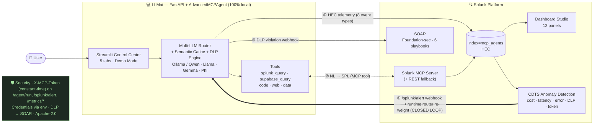

# LLMai — Architecture Diagram

> **LLMai: Closed-Loop Agentic Ops on Splunk** — a 100% local AI agent that streams
> its telemetry into Splunk **and** lets Splunk reconfigure it autonomously.
> Track: Observability · Repo: https://github.com/sechan9999/splunk_hec ·
> Live: https://splunkhec.streamlit.app/

## High-level (rendered by GitHub)



## Plain-text version (for terminals / Devpost paste)

```
                      LLMai — Closed-Loop Agentic Ops on Splunk

  ┌──────────────── LLMai  (FastAPI + AdvancedMCPAgent, 100% local) ─────────────┐
  │  👤 User ▶ Streamlit Control Center ▶ /agent/run ▶ Multi-LLM Router          │
  │           (5 tabs, Demo Mode)        │           + Semantic Cache + DLP      │
  │  Tools: splunk_query · supabase_query · code · web · data                    │
  └──┬───────────────┬───────────────┬───────────────┬───────────────────────────┘
     │① HEC          │② MCP/REST     │③ DLP webhook   │④ /splunk/alert webhook
     │ telemetry     │ NL → SPL      │ PII risk       │ (CLOSED LOOP)
     ▼               ▼ ▲             ▼                ▲
  ┌──────────────────┼─────────────────────────────────┼─────────────────────────┐
  │  SPLUNK PLATFORM  │                                 │                         │
  │  index=mcp_agents ┘   Splunk MCP Server  ──────────┘   Splunk SOAR             │
  │  Dashboard Studio     Foundation-sec PII scoring        (6 playbooks)          │
  │  (12 panels)                                           CDTS anomaly detection │
  │                                                        ──────────┬───────────┘
  │                                                                  │ ④ runtime
  └──────────────────────────────────────────────────────────────────┘ router re-weight
                                                                       + auto-restore
                                                                       after cooldown
```

## Numbered flows

| # | Flow | What happens | Code |
|---|------|--------------|------|
| ① | **Telemetry IN** | Every LLM call, router decision, tool call, cache hit/miss, DLP violation, anomaly streams to Splunk HEC (async batched, 8 `event_type`s). | `splunk_telemetry.py`, hooks in `multi_llm_platform/llm_router.py`, `semantic_cache.py` |
| ② | **Splunk as MCP tool** | Agent translates natural language to SPL via the Splunk MCP Server (REST fallback) — "LLM cost in the last hour?" → answer. | `tools/splunk_mcp_tool.py`, `advanced_agent.py` (`_tool_splunk_query`, `_tool_supabase_query`) |
| ③ | **DLP → SOAR** | DLP violation is risk-scored by Foundation-sec and routes to one of 6 Splunk SOAR playbooks (block / quarantine / notify / IOC enrich / executive alert / auto-remediate). | `security/soar_bridge.py`, `patch_dlp_engine_with_soar()` |
| ④ | **Closed loop** | Splunk CDTS detects a spike (cost / latency / error / DLP burst / token overrun) → POSTs `/splunk/alert` → `RouterRemediator` **re-weights the agent's model router at runtime** → daemon thread restores weights after the cooldown. | `auto_remediation.py` (`AnomalyHandler`, `RouterRemediator`), `main.py` |

## Cross-cutting

- **Security**: shared-secret `X-MCP-Token` (constant-time `hmac.compare_digest`) on
  `/agent/run`, `/splunk/alert`, `/metrics/*`; env-gated and graceful when unset
  (`security/api_auth.py`).
- **Graceful degradation**: every Splunk hook is `try/except` and env-gated, so the
  base agent has **zero regression** when Splunk env vars are absent.
- **Privacy / locality**: agent + LLMs (Ollama / Qwen 2.5 Coder · Llama 3.x · Gemma /
  Phi / Mistral via XML fallback) run **on your hardware**. No prompts, code, or
  terminal history leave the machine.
- **Open source**: Apache-2.0.

## Submission assets

- **Dashboard JSON**: [`splunk_app/dashboards/mcp_agents_overview.json`](splunk_app/dashboards/mcp_agents_overview.json) (12 panels)
- **Splunk screenshot**: [`assets/splunk_dashboard.png`](assets/splunk_dashboard.png)
- **HEC seeder**: [`tools/seed_dashboard_demo.py`](tools/seed_dashboard_demo.py)
- **Demo video kit**: [`docs/DEMO_VIDEO.md`](docs/DEMO_VIDEO.md)
- **Pitch deck**: [`docs/LLMai_Pitch.pptx`](docs/LLMai_Pitch.pptx)
